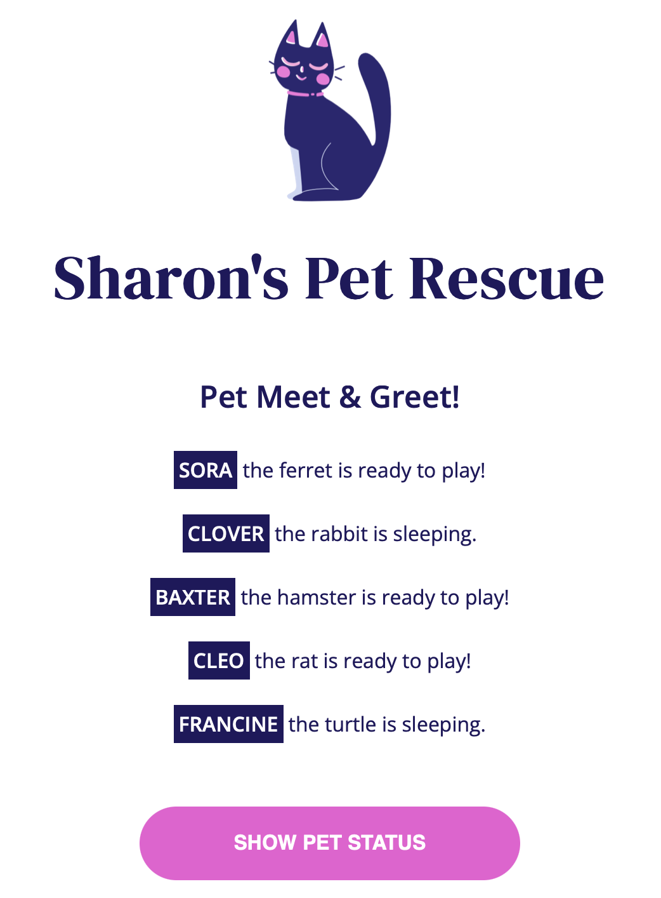

<h1>Sharon’s Pet Rescue</h1>

<h2>Objective:</h2>

The program allows visitors to view pets available for interaction, hopefully, leading to some pet adoptions.

<h3>Description:</h3>

 A factory function pattern was created to accept each animal’s name, species, and tiredness as a parameter. Methods were written to indicate each animal’s status, including whether they are sleeping or awake and ready to play. The data on each pet populates the web page by looping over objects in an array. The updated status helps visitors know which animals they can interact with and get to know.

<h4>JavaScript Toolbox:</h4>

* Factory Functions
* Object Literals
* Dot Notation
* querySelector()
* Property Methods
* Template Literals
* Conditional Statements
* this. keyword
* Assignment Operator
* Verify Objects & Methods
* for…of loop
* createElement()
* innerHTML
* Arrays 

